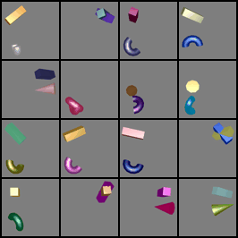

# OBR
**Object-centric Behavioural Reasoner from Pixels**

Code and results from the paper (under review, will be fully open uppon acceptance): 

_Ruben van Bergen1, Justus Hueboter1 & Pablo Lanillos1,2 (2024). "Object-centric proto-symbolic behavioural reasoning from pixels"_

1. Donders Institute, Radboud University, Nijmegen, The Netherlands
2. Neuro AI and Robotics (NAIR) Group, Cajal International Neuroscience Center, Spanish National Research Council, Madrid, Spain

This work has been funded by the SPIKEFERENCE project, co-funded by the Human Brain Project (HBP) Specific Grant Agreement 3 (ID: 945539).
- Preprint: https://arxiv.org/pdf/2411.17438
- Access to the full code and enviroment: https://github.com/rubvber/OBR

## OBR deep learning architecture

## Learned rules

## Results
Here we describe some of the executions of the OBR with 3D objects.

### #2 3D objects
|OBR execution|Desired idealized goal|
|:-------------------------:|:-------------------------:|
|  | |

### #3 3D objects
|OBR execution|Desired idealized goal|
|:-------------------------:|:-------------------------:|
|  | |

### #4 3D objects
|OBR execution|Desired idealized goal|
|:-------------------------:|:-------------------------:|
|  | |

### #5 3D objects
|OBR execution|Desired idealized goal|
|:-------------------------:|:-------------------------:|
|  | |
